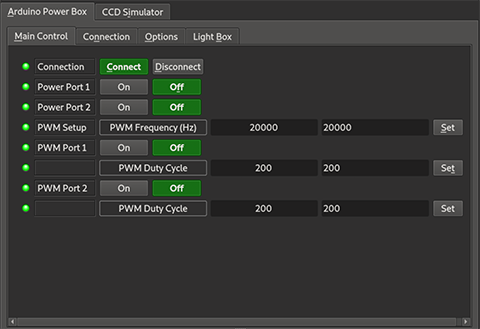
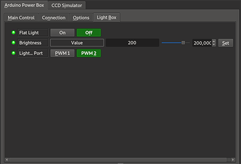

# Arduino Power Box
With Arduino Power Box you can build your own small power box and control all its ports through INDI. It gives you full remote and independant control over **two PWM ports** and **two power ports**.

The package contains
* Arduino firmware (tested on Wemos D1 Mini Pro) for PWM signal creation and switch control.
* INDI driver for controlling the power box through INDI.

## Hardware
For building the power box, you need
* An [Arduino](https://www.arduino.cc/). There are no specific requirements, the firmware  should run on most of them. I personally prefer the ESP8266 based boards like the [Wemos D1 mini pro](https://wiki.wemos.cc/products:d1:d1_mini_pro).
* An H-bridge like an L298N motor driver for the supply of a 12V PWM signal - select an appropriate controller for your specific power requirements
* Two optocouplers to attach the power switches to your Arduino
* 4 power jacks of your choice
* A housing
* Soldering equipment

For the electrical part please consult tutorials available on the internet. There are plenty of them available how to attach H-bridges to PWM ports and optocouplers to digital ports of an Arduino.

## Firmware Installation
For installing the firmware onto a Arduino, you first need the [Arduino IDE](https://www.arduino.cc/en/Main/Software). Download it for your operating system of choice and install it. The next step is to install the board definitions for your board of choice (see instructions from the board manufacturer).

The serial communication is JSON based and therefore requires the **ArduinoJSON** library. Install it with the **Library Manager** of the Arduino IDE.

### Firmware Configuration
There are a few configurations necessary before you upload the firmware to your Arduino. Please open `powerbox.ino` from `devices/Firmwares/powerbox` and switch to the `config.h` tab. There you can configure the pins to be used controlling the PWM signal and the power switches.

If this is done, you are ready to upload the firmware to your Arduino. Select your board from `Tools > Board...`, select the right USB port with `Tools > Port` and upload the firmware using `Sketch > Upload`.

As soon as this succeeds, you are ready for testing your board. With the serial monitor (start `Tools > Serial Monitor`), you can communicate via single character commands with your Arduino. The following commands are supported:
* h - show the help message
* c - show the configuration
* i - show devices status information
* f?value=&lt;frequency&gt; - change the PWM frequency
* d?id=&lt;[1|2|&gt;&amp;value=&lt;duty cycle&gt; - change the PWM duty cycle
* p?id=&lt;[1|2|&gt;&amp;power=[on|off] - turn PWM on or off
* s?id=&lt;[1|2|&gt;&amp;power=[on|off] - turn switch on or off

If everything is shown as expected, your hardware is ready!

### INDI server setup
Using the INDI driver depends upon the scenario how you want to use **Arduino Power Box**. If you want to simply use it in combination with your INDI client of choice (like e.g. KStars), there is no special setup required.

Now start your INDI client of choice (if you are using KStars, start EKOS with `Tools > EKOS`), switch to the **Connection** tab and **select the port** where your power box is connected to.

Now Switch to the **Main Control** tab and hit the **Connect** button. The Main Control tab should now display the status of the two power ports and the two PWM ports:

Additionally, there is a **Light Box** tab where you can use one of the PWM ports for controlling flat panels. In the last row you can select which of the PWM ports should be used for controlling your light box:

Have fun!