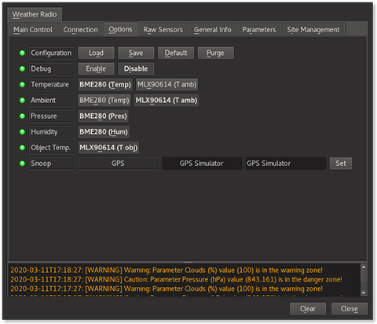
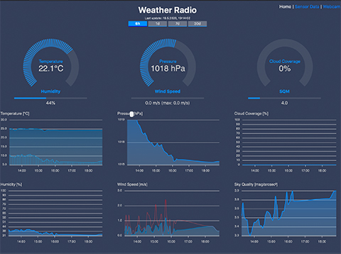

# Weather Radio
Weather Radio is a software suite for building your own weather station with [Arduino](https://www.arduino.cc/) using all types of environment sensors for temperature, pressure, humidity etc. It contains also advanced features like **cloud detection**, measuring the **sky quality** and sky observation through a camera device like a **Raspberry Camera**

Here is an example how a weather station could look like - inspired by the construction of bird nesting boxes:


A wooden housing, attached to my backyard shed gives a Raspberry Zero a weather proof shelter. On the front side there is a acrylic glass dome where a Raspberry Camera continuously observes the sky. On the left side of the housing there is a small grey box hosting all weather sensors. All weather data is open available through my website [weather.openfuture.de](http://weather.openfuture.de/).

This software suite contains:
* Arduino Firmware (tested on Arduino Nano, Adafruit Metro Mini, Wemos D1 Mini Pro, but should work on most Arduinos) reading out sensor values and publishing them as JSON document.
* INDI driver for integrating the weather station into your observatory setup.
* Javascript based web page for displaying current weather data and graphs for historic weather data and weather images.

## Hardware
For building your own weather station, you need
* An **Arduino**. There are no specific requirements, Weather Radio should run on most of them. I personally prefer the ESP8266 based boards like the [Wemos D1 mini pro](https://wiki.wemos.cc/products:d1:d1_mini_pro), since they are small and have their own WiFi antenna integrated. But having WiFi is not a must, you can communicate with the Arduino through a serial interface.
* A set of **environment sensors** - feel free to choose those that deliver weather data you are interested in:
  * **DBE280** for temperature, humidity and air pressure
  * **DHT22** or **DHT11** as an alternative to the DBE280 for humidity and temperature
  * **MLX90614** for cloud detection
  * **TSL2591** for measuring light and determining the sky quality
  * [Davis Instruments Anemometer](https://www.davisinstruments.com/product/anemometer-for-vantage-pro2-vantage-pro/) for measuring wind speed and wind direction
  * Tipping bucket based rain sensors like [Hydreon Rain Sensors](https://rainsensors.com)
  * Resistor based rain drop sensors (see [this example](https://create.arduino.cc/projecthub/MisterBotBreak/how-to-use-a-rain-sensor-bcecd9))
  * SSD1306 based OLED displays
* A housing

## Connecting Sensors to the Arduino
This part requires some basic knowledge in soldering electronic components. Here one of my recent setups:


This is an example with a Wemos D1 mini pro V1, the sensors DBE280, DHT22, MLX90614 and TSL2591 and a RJ11 (6P4C) jack for connecting the Davis Instruments Anemometer.

Besides supplying power to a sensor (VCC = +3.3 V or +5 Volt and GND = Ground), Arduino boards offer several types of connections to transmit data between sensor and the Arduino:
* **I2C** - a two wire bus where several components could be connected in parallel. It offers a **SCL** (= serial clock) and a **SDA** (= serial data) connection. This is the connectivity for the DBE280, MLX90614 and TSL2591.
* **Digital ports** as one-wire connection (on top of VCC and GND), connecting one single sensor. This is the connectivity for DHT and for the Davis Instruments wind speed.
* **Analog ports** as one-wire connection reading values between 0..1024, where 0 = GND and 1024 = VCC. This is the connectivity for the Davis Instruments wind direction.

In order to find out, which is the correct pin, check the **pinout** for your board of choice. Please be aware, that there are several numbering schemes. There is the **Arduino style**, that is used by the Arduino and Adafruit boards. And there is the **NodeMCU style**, that is used for the ESP8266 boards, which is different.

So before you solder everything together, it is a good idea to install everything on a breadboard and test it. Here a sample breadboard setup with a Wemos D1 mini pro V1, a BPE280 and a MLX90614:


In this example, the SDA port of the two sensors is connected to D2 (black wire), SCL to D1 (white wire), VIN (3.3V, red wire), GND (brown wire).

## Adding an OLED Display
In case that you want to show the your sensor data directly on your weather station, you may attach an SSD1306 based OLED to your Arduino. Connecting the display itself is quite trivial, since the display can be attached to the I2C bus.

The display has a configurable timeout turning off the display. If you want to use this feature, you need to add a push button to one of the digital ports of the Arduino. The port can be configured with the OLED_BUTTONPIN variable in config.h. The button should connect the digital port to +5V/+3.3V if it is closed. Additionally, add a 47k pull down resistor connected to GND.

## Firmware Installation
For installing the firmware onto a Arduino, you first need the [Arduino IDE](https://www.arduino.cc/en/Main/Software). Download it for our operating system of choice and install it.

The next step is to install the board definitions for your board of choice (see instructions from the board manufacturer) and the [libraries](https://www.arduino.cc/en/Guide/Libraries) for all sensors you want to connect.

###Arduino Libraries
Depending on your selection of sensors, you need some additional libraries. Install them with the **Library Manager** of Arduino.

* **ArduinoJSON** Required, Weather Radio communicates with JSON documents.
* **SSD1306Ascii** Display ASCII text on the OLED display.
* **OneButton** Use a simple button to active the OLED display.
* **Adafruit_TSL2591** TSL 2591 light sensor library
* **Adafruit_BME280** BME 280 sensor for pressure, temperature and humidity
* **DHT** DHT 11/22 humidity sensor
* **Adafruit_MLX90614** Melexis 90614 IR sensor (used for cloud recognition)
* **ESP8266-ping** Library necessary if you use a ESP8266 board
* **ArduinoOTA** Nessesary if you want to use the "over the air" feature of ESP8266 boards for updating via WiFi.

### Firmware Configuration
There are a few configurations necessary before you upload the firmware to your arduino. Please open `weatherradio.ino` from `devices/Firmwares/weatherradio` and switch to the `config.h` tab.

First select the sensors that you have attached to your board:


Please comment out all sensors that you do not want to use. By default, the sensors BME280, MLX90614 and TSL2591 are selected. If you have a **ESP8266 board**, you can enable the WiFi connectivity and enable the `USE_WIFI` switch.

The second step is to set **specific parameters** for your sensors and the WiFi connection:


If this is done, you are ready to upload the firmware to your Arduino. Select your board from `Tools > Board...`, select the right USB port with `Tools > Port` and upload the firmware using `Sketch > Upload`.

As soon as this succeeds, you are ready for testing your board. With the serial monitor (start `Tools > Serial Monitor`), you can communicate via single character commands with your Arduino:


The following commands are supported:
* **v** show the firmware version
* **w** show the current sensor values (one line version)
* **p** show the current sensor values (pretty printing version)
* **c** show the firmware configuration
* **s** (re)connect WiFi. If issued as `s?ssid=<your WiFi SSID>&password=<your WiFi password>`, it connects with the given parameters.
* **d** disconnect from WiFi
* **r** issue a reset to the Arduino

If everything is shown as expected, your hardware is ready!

## INDI driver **Weather Radio**
Weather Radio comes with its own INDI weather driver and supports observatory control through **weather warnings** and **weather alerts**.

### INDI server setup
Using the INDI driver depends upon the scenario how you want to use **Weather Radio**. If you want to simply use it in combination with your INDI client of choice (like e.g. KStars), there is no special setup required.

If you want to provide weather data in a 24x7 mode to weather station clients like for example its own web interface (see below), you need to **start the INDI server separately**. The simples way for this is starting `indiserver -v indi_weatherradio` from a terminal. On Linux machines, you may create a dedicated service that automaticall starts during startup. Create the following service definition in `/etc/systemd/system/indi-weatherradio.service`:
```
[Unit]
Description=INDI server for weather radio
Wants=network-online.target
After=network-online.target

[Service]
Type=simple
User=root
ExecStart=/usr/bin/indiserver -v indi_weatherradio

[Install]
WantedBy=multi-user.target
```

For activating and starting this service, execute the following commands:
```
sudo systemctl enable indi-weatherradio.service
sudo systemctl start indi-weatherradio.service
```
   
### Driver configuration
In KStars, select **Weather Radio** as weather device in your profile. 

Now start your INDI client of choice (if you are using KStars, start EKOS with `Tools > EKOS`), switch to the **Connection** tab and **select the port** where your weather station is connected to.

The INDI driver supports both a serial USB connection as well as an ethernet connection to the Arduino.

The standard way is using the **Serial** connection via USB. Select the USB device where the Arduino is connected to the INDI server host and its baud rate:


If you are using an Arduino model like the ESP2866 that has a build in WiFi connection, you may also use the **Ethernet** connection mode. Enter the IP adress and the port where the Arduino is listening on:


Now Switch to the **Main Control** tab and hit the **Connect** button.

The Main Control tab should now display weather parameters that could be determined with the sensors you connected to your board. In my test setup, I have a BME280 and a MLX90614 connected, hence the INDI driver shows temperature, pressure, humidity and cloud coverage values:


### Selecting sensors
Typically, there are more than one sensor attached, that measure a certain weather parameter. Therefore Weather Radio offers a selection, from which sensor each weather parameter is read.



In this example the temperature, pressure and humidity is retreived from BME280, the ambient temperature and object temperature from MLX90614 (ambient and object temperature are used to calculate the cloud coverage).

Select the sensor setup of your choice and **save** the configuration.

### INDI Driver Configuration
For some weather parameters, additional configurations are needed:
* The **Pressure** value comes as an absolute value from the sensor and is displayed in the INDI driver on sealevel basis. Therefore it is necessary to set the **elevation** of your location properly to receive correct values.
* On the **Parameter** tab you can set the OK ranges for each weather parameter.

### Calibrating weather parameters
Depending on the local settings and sensor manufacturing variations it is necessary to calibrate the calculated weather parameters:


That's it, now your INDI driver is ready to use!

## Web Interface
Inspired by the approach of [Induino Meteostation Web Interface](https://indiduino.wordpress.com/2013/02/03/meteostation-web-interface/), Weather Radio comes with its own web interface. It follows the same approach with HTML and Javascript, but is build with modern technologies like [Bootstrap 4](https://getbootstrap.com) and [Apexcharts](https://apexcharts.com) for displaying current weather parameters and time series for these parameters. Below there is the good old work horse [RRD toolset](https://oss.oetiker.ch/rrdtool/) for storing time series data.



### Installation
The web interface needs to be integrated into a running web server. For simplicity reasons we assume that you are running [Apache web server](https://httpd.apache.org) on a Linux machine.

#### Install dependencies
```
sudo apt-get install python python-rrdtool
pip install simplejson utidylib pathlib ffmpeg-python
```

#### Apache Setup
Copy the entire `weatherradio` folder from the `add-on` directory to a location where Apache can serve them from.
```
sudo mkdir /usr/share/weatherradio
cp -a add-on/weatherradio/html add-on/weatherradio/bin  /usr/share/weatherradio
```

Install and activate the Apache configuration
```
sudo cp add-on/weatherradio/weatherradio.conf /etc/apache2/conf-available
sudo a2enconf weatherradio
sudo systemctl reload apache2
```
That's it for the web server installation, check if [http://yourserver/weatherradio](http://yourserver/weatherradio) shows up with empty charts.

### Connecting the INDI device
`weatherradio/bin` holds a set of python scripts that read out data from the INDI server, store the data in a RRD file and create JSON files holding the current weather data as well as time series.

Create a directory that will hold the JSON files:
```
mkdir /usr/share/weatherradio/html/data
```

Edit the configuration file `/usr/share/weatherradio/bin/wr_config.py`. In most cases, you need to change only these two values:
* INDISERVER is the address of the INDI server where your weather station is connected to.
* INDIDEVICEPORT is the connection port of your weather station (e.g. "/dev/ttyUSB0")

Starting with version 1.8, there is an option to read weather parameters from **multiple weather devices**. The only restriction is that these devices are available from a single INDI server. In this setup, separate the parameter values with ",".

Here a sample with two devices, one named "Weather Radio" and another one "Davis Weather". Both are using ESP8266 devices and are reachable via WiFi:
```
INDIDEVICE="Weather Radio,Davis Weather"
INDIDEVICEMODE="Ethernet,Ethernet"
INDI_IP_ADDRESS="172.28.4.40,172.28.4.80"
INDI_IP_PORT="80,80"
GEO_COORD_LAT="49.1064,49.1064"
GEO_COORD_LONG="9.765,9.765"
GEO_COORD_ELEV="375,375"
```

Next step is **creating the RRD files** that will store time series data from your weather station:
```
cd /usr/share/weatherradio
./bin/wr_rrd_create.py
./bin/wr_rrd_create_sensorfile.py
```

Now try to update the weather data manually to see if everything is configured correctly. There are three types of scripts for these actions:
* `wr_rrd_update.py` reads weather data from your weather station's INDI server and stores it in the RRD files for weather and sensor data
* `wr_rrd_lastupdate.py` creating a JSON document with the latest weather parameters
* `wr_rrd_fetch.py` which fetches a time series for a given interval

First, read the current weather data and create the JSON files:
```
cd /usr/share/weatherradio
./bin/wr_rrd_update.py 
./bin/wr_rrd_
./bin/wr_rrd_fetch.py -s 6h
./bin/wr_rrd_fetch.py -s 1d
./bin/wr_rrd_fetch.py -s 7d
./bin/wr_rrd_fetch.py -s 30d
 ```
 When you reload the web page, you will (or you should at least) see the current weather data displayed. For a correct display of timelines, it needs some data points to be retrieved with `/bin/wr_rrd_fetch.py`.

Finally, it's time to automate by creating crontab entries:
```
#
# cron jobs for arduino weather radio
#
#
 4,9,14,19,24,29,34,39,44,49,54,59 * * * *     <userid> /usr/share/weatherradio/bin/wr_rrd_update.py

#---------------------------------------------------
# Update JSON export files
#---------------------------------------------------
 */5 * * * *     <userid> /usr/share/weatherradio/bin/wr_rrd_lastupdate.py 
 */5 * * * *     <userid> /usr/share/weatherradio/bin/wr_rrd_fetch.py -s 6h
 */15 * * * *     <userid> /usr/share/weatherradio/bin/wr_rrd_fetch.py -s 1d
 0 * * * *     <userid> /usr/share/weatherradio/bin/wr_rrd_fetch.py -s 7d
 0 0 * * *     <userid> /usr/share/weatherradio/bin/wr_rrd_fetch.py -s 30d

 */5 * * * *   <userid> /usr/share/weatherradio/bin/wr_rrd_lastupdate.py -o /usr/share/weatherradio/html/data/RTsensors_lastupdate.json /usr/share/weatherradio//sensors.rrd
*/5 * * * * <userid> /usr/share/weatherradio/bin/wr_rrd_fetch.py -s 6h -o /usr/share/weatherradio/html/data/RTsensors_6h.json /usr/share/weatherradio/sensors.rrd
*/15 * * * * <userid> /usr/share/weatherradio/bin/wr_rrd_fetch.py -s 1d -o /usr/share/weatherradio/html/data/RTsensors_1d.json /usr/share/weatherradio/sensors.rrd
0 * * * * <userid> /usr/share/weatherradio/bin/wr_rrd_fetch.py -s 7d -o /usr/share/weatherradio/html/data/RTsensors_7d.json /usr/share/weatherradio/sensors.rrd
0 0 * * * <userid> /usr/share/weatherradio/bin/wr_rrd_fetch.py -s 30d -o /usr/share/weatherradio/html/data/RTsensors_30d.json /usr/share/weatherradio/sensors.rrd

```
*Hint*: Replace `<userid>` with your user ID that has **write access** to `/usr/share/weatherradio/html/data`.

## Camera integration

Raspberry Cameras offer a simple and cheap way to continuously monitor the sky. If you are using the NoIR camera (the version having increased sensitivity, since the IR filter is removed), you can shoot simple timelapse videos of the night sky.

The simplest hardware setup is
* a Raspberry Zero
* a Raspberry Camera
* a transparent weather shield like a acrylic dome to shield the camera from the weather

Optionally, you could atach a [pan/tilt device](https://learn.sparkfun.com/tutorials/setting-up-the-pi-zero-wireless-pan-tilt-camera/all) so that you could move the camera around. Here an impression of my own setup:


As a first step you need to learn how to shoot images with your camera. If you are using a Raspberry Camera, the Raspberry plattform brings `raspistill` as command line tool to shoot images -- see the [Camera Module Documentation](https://www.raspberrypi.org/documentation/hardware/camera/README.md) on the Raspberry pages.

The web interface contains a page to display a timelapse and recent images in a image slider:


There are some helper scripts provided:
* `autoexposure.py` is a library for calculating optimal exposure setup for time lapse capturing.
* `camery.py` for shooting images and automatically adapting exposure time, ISO etc so that it can be regularly executed by a cron job. During daylight, an image frequency of 60 seconds is feasible, during night time the underlying raspistill is too slow.
* `imageconverter.py` is a service that converts captured frames to smaller sizes. It is designed to collaborate with both camera.py and timelapse.py.
* `timelapse.py` is a time lapse service for shooting regularly images with a raspberry camera. It uses also the functions from autoexposure.py to adapt the exposure time. With this service it is possible to shoot an image every 30-45 seconds even with longer exposure times.
* `timelapse-stop.sh` is a shell script to stop the time lapse service. Do not kill the time lapse process directly, since this may either fail or may block the camera device making it necessary to reboot the Raspberry.
* `updatemedia.sh` is a script that creates time lapse videos and updates the image slider using wr_list_media.py and wr_video_create.py.
* `wr_list_media.py` creates a JSON document that provides the image slider informations to the web page. It takes all image files from the media directory (option `-d`) and places them sorted in the image slider.
* `wr_video_create.py` creates timelapse sequences from the captured images. Create a link called `html/media/timelapse_current.mp4` to display the video on the web page.

Have fun!