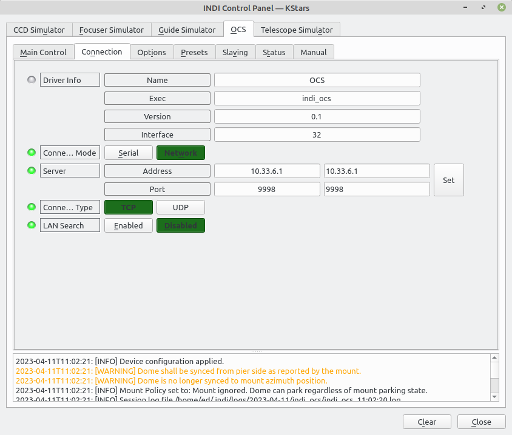

# Observatory Control System (OCS)

The OCS is an open source (hardware and software) Observatory control that is very flexible and customisable.
See [OCS groups wiki](https://onstep.groups.io/g/onstep-ocs/wiki) for full info.

## Installation

indi_ocs is released as a 3rd party driver in source and binary packages. It is compatible with libindi >= v2.0.1

## Features

The following features of OCS are supported by this driver:

 - Roll Off Roof / Dome Shutter control
 - Dome control and mount slaving
 - Power device control
 - Lighting control
 - Observatory thermostat control
 - Weather monitoring

## Configuration
Connection via USB and Ethernet are supported.
If using Ethernet connectivity a persistent port on the OCS is recommended (eg. 9998).

Similar to the modular functionality of the in-build OCS website, options that are not enabled in the OCS config.h are not displayed.

Functional options configured in the OCS software are detected upon connection and applied in the driver. For example, if you have configured a Power Device 1 with a name of "Flats Panel" this name will be used for the control in the driver. Similarly if you have defined a weather device safety limit in the OCS configuration this limit will initially be used in the driver.

The standard INDI Dome parameters configuration is required for Dome slaving.

## Driver Tab walkthrough
### Main Control

- Connection - Connect(ed)/Disconnect(ed) control/indication
- Shutter - Open(ed)/Close(d) control/indication. For OCS ROR configurations this control is for the **roof**. Unfortunately there is no way to rename this standard control
- Status > Roof/Shutter - The current status of the roof/shutter system is displayed eg. Open, Closing: Travel 36%, Error code, etc.
- Absolute Position > Degrees - Setting an Azimuth position instructs the dome to move to it.
- Abort Motion - Immediately requests a halt of both dome and roof/shutter movement.
- Sync > Az - Setting an Azimuth position performs a sync on the dome ie. tells it "you are here".
- Parking - Park(ed)/UnPark(ed) control/indication. Sends the dome to the defined park position/removed the dome from parked status.
- Additional Controls
	+ Set Park - Sets the current Azimuth position as the dome park position.
	+ Return Home - Sends the dome to the defined home position.
	+ At Home (Reset) - Tells the dome it is at the defined home position.
- Status > Dome - The current status of the dome eg. Home, Parked, Idle, Slewing, Error code, etc.

### Connection

Standard INDI Connection tab controls.
Use either Serial (USB) connection (which in testing of OCS4 hardware showed up as /dev/ttyACM0 or auto mapped /dev/serial/by-id/usb-Teensyduino\_USB\_Serial_12345678-if00) or Network using the OCS address and port 9998.

### Options

Standard INDI Dome Option tab controls.

- Polling - Sets the refresh period (in ms) of the roof/shutter and dome status.
- Mount Policy - If set to: Mount locks the the **dome** is prevented from parking when mount is unparked. 
- Shutter > Close on Park, Open on UnPark. 

**Note that this option is independent of the OCS option ROOF\_CLOSE\_PARKS\_MOUNT. If that option is set in the OCS configuration it is always active. These controls act in addition to that option and are not aware of it.**

### Presets

Allows creation and GoTo of up to three stored locations of dome Azimuth.

### Slaving

Controls for configuring the dome > mount slaving functionality. Refer to [INDI Dome Devices](https://www.indilib.org/devices/domes.html) for details.

### Status

Shows miscellaneous details about the OCS.

- Firmware version - As reported by OCS. The driver expects a minimum version and will report if the connected OCS software is below this.
- Roof last error - This message is persistent until a roof/shutter movement clears the status.
- Mains status - This is dependent on OCS configuration and does not contribute toward the Safe status of the observatory within the driver, which is independent of the safe status within OCS.
- MCU temperature ℃ - the internal temperature of the OCS microcontroller, if supported by the OCS hardware used.

### Weather

**Note: this tab is only displayed if the Weather function is configured within the OCS software.**

These controls define the minimum and maximum limits outside of which the measurement is considered unsafe to the observatory operation.

- Update > Period (s) - This sets the refresh period for weather measurements. Don't bother going lower than the default 60 seconds as the OCS software internally polls once per minute so a faster refresh will just retrieve stale data.
- Weather > Refresh - Forces an immediate poll of weather measurements - see note above.
- Safety > Override Status - Ignore unsafe weather conditions.
- Status - The safe/unsafe status of the OCS configured measurements.
- Parameters - The readings returned of the OCS configured measurements.
- Limits - Each OCS configured weather measurement has three controls, a maximum level above which it's status is considered unsafe, a minimum level below which it's status is considered unsafe, and a percentage towards the limit that is considered to be a warning status

**Note that the OCS internal safety status is independent of these driver settings. OCS considers Rain, Cloud cover, Wind speed & Mains power present towards it's safety status (if they are configured) and will operate independent of these settings and driver connection.**

**Safe limits defined in the OCS software for Wind speed and Cloud cover are copied into the driver as initial limits upon connection. They may be over-ridden here but are not applied back to the OCS software. In addition, temperature, pressure & humidity are considered towards the INDI safety status. If not required for this purpose but only to be monitored, just set the min/max limits very wide so that they are always considered to be safe**.

There are some weather measurements supported by the OCS that can not be used as contributors towards the safety status. If configured in the OCS software these will appear at the bottom of the tab.

- Cloud > description - A text string describing the amount of cloud cover, from "Clear" to "Very-Cldy".
- Sky Quality> mag/arc-sec² - A measurement of the sky darkness.
- Sky temp > ℃ - The sky temperature taken from an IR sensor.

### Thermostat

**Note: this tab is only displayed if the Thermostat function is configured within the OCS software.**

These controls display the status of and control the setpoints of any configured observatory thermostat devices. Readings are update once per minute regardless of the Options > Polling period setting.

- Obsy Status > Temperature ℃ - Internal observatory temperature
- Obsy Status > Humidity % - Internal observatory humidity
- Setpoint > Heat ℃ (0=OFF) - If the internal observatory temperature falls below this setpoint the defined Heat Relay is activated, for example to turn on a heater.
- Setpoint > Cool ℃ (0=OFF) - If the internal observatory temperature rises above this setpoint the defined Cool Relay is activated, for example to turn on a ventilation fan.
- Setpoint > Dehumidify % (0=OFF) - If the internal observatory humidity rises above this setpoint the defined Humidity Relay is activated, for example to turn on a dehumidifer.
- Heat Relay/Cool Relay/Rh Relay - These are indication of status only.

**Note that the setpoints are saved in the OCS non-volatile storage and therefore are active until overwritten or disabled regardless of driver connection.**

**Note that there is an OCS option CONTROL\_WITH\_ROOF\_OPEN. If this is set to OFF (the default) then the thermostat setpoint controls are ignored when the roof/shutter is opened. This is independent of this driver.**

### Power

Any OCS configured power device is shown with the defined name, and ON/OFF controls/status indication that activate the defined relay.

### Lights

Any OCS configured lighting device is shown with ON/OFF controls/status indication that activate the defined relay.

### Manual

-

**Note the warning at the top of this tab - these are controls that directly address the hardware in ways that could result in lost data, damage to equipment, or in the worst case sudden movement of equipment that has the potential for injury.**

-

- Interlocks > OVERRIDE. This control causes the roof/shutter interlock signals to be ignored for one movement command. Only intended for testing and/or temporary interlock failure overrides.
- Roof Power > MAX. This control overrides any configured roof/shutter power level and just enables the motor at 100% power. Only intended for forcing the roof/shutter to close under failure conditions.
- Watchdog > REBOOT. **If the OCS Watchdog function is configured ON**, and neither the roof/shutter nor the dome are in motion, this control will cause the OCS controller to enter a deadlock forcing the watchdog to reboot the controller.
