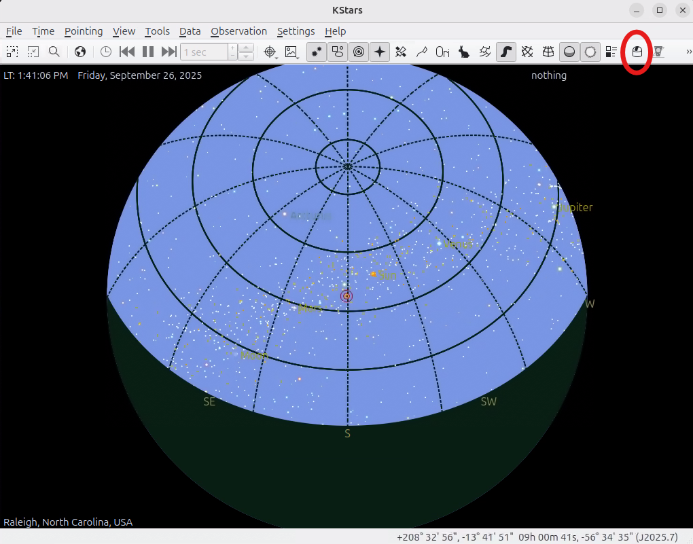
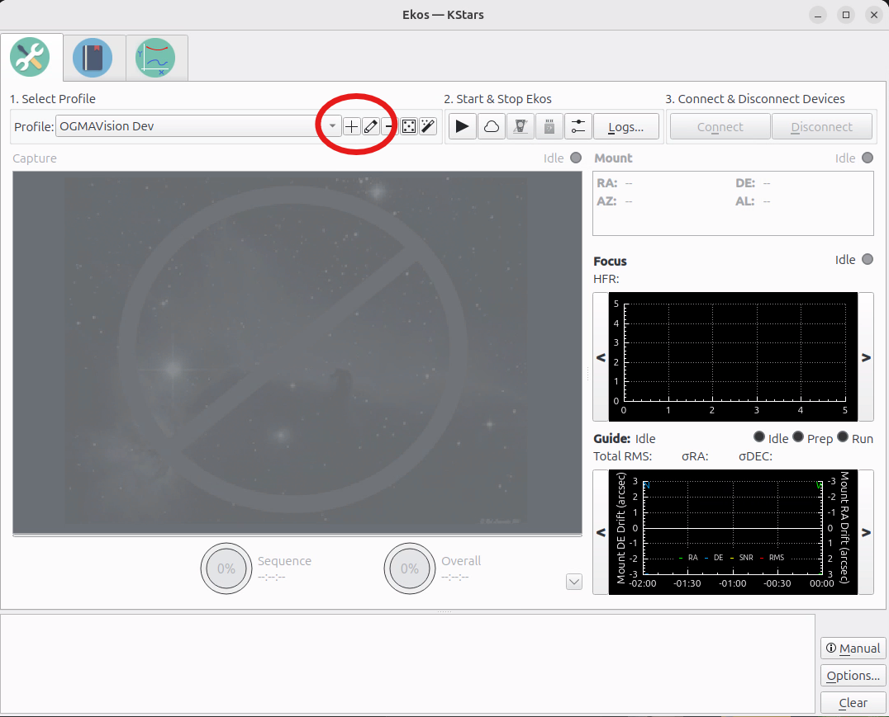
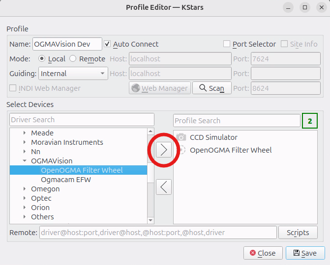
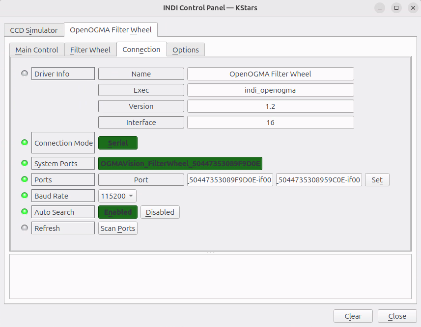

# OpenOGMA Filter Wheel Driver

## Metadata

- **Driver Name**: OpenOGMA Filter Wheel
- **Executable**: indi_openogma
- **Author**: OGMAVision
- **Version**: 1.2
- **Device Type**: Filter Wheel
- **Connection Type**: USB CDC (Serial Communication Device)
- **Platforms**: Linux, macOS, Windows (via INDI)
- **INDI Interface**: Filter Wheel Interface

## Overview

The OpenOGMA Filter Wheel is a precision astrophotography accessory designed for automated filter selection during imaging sessions. This INDI driver provides comprehensive control over the filter wheel, including automatic protocol detection, intelligent calibration management, and robust error recovery.

### Key Features

- **Dual Protocol Support**: Automatically detects and uses FRAMED (binary) or TEXT protocols
- **Auto-Calibration**: Firmware automatically calibrates on power-up with manual override capability
- **Hot-Plug Recovery**: Automatic reconnection and re-synchronization after USB disconnection
- **Smart Filter Management**: Dynamic property adjustment based on detected slot count (1-7 filters)
- **Position Handling**: INDI-compliant 1-based positioning with automatic firmware 0-based conversion
- **Command Queuing**: Intelligent queuing of user commands during calibration or movement
- **Robust Communication**: CRC checksums, timeout handling, and automatic retry mechanisms

### Supported Models

- OpenOGMA Filter Wheel (all firmware versions)
- Compatible with firmware supporting both FRAMED and TEXT protocols
- Auto-detection of slot count (typically 5 or 7 slot configurations)

## Installation

### Dependencies

- **INDI Core Library** (≥ 1.9.0)
- **libindi-dev** - INDI development headers
- **cmake** (≥ 3.10) - Build system
- **gcc/g++** with C++17 support
- **libusb-1.0-dev** - USB communication library
- **pkg-config** - Dependency detection

### Installation Steps

For regular astronomy use, just install INDI with Ekos as documented elsewhere.

For example: https://docs.indilib.org/getting-started/

Make sure you install the third party drivers.

#### Package Installation (if available)

```bash
# Ubuntu/Debian (when package becomes available)
sudo apt-get update
sudo apt-get install indi-openogma

# Fedora/RedHat (when package becomes available)
sudo dnf install indi-openogma
```

For developers or advanced users, install by cloning the repository.

#### From INDI 3rd Party Repository

```bash
# Install as part of the INDI 3rd-party drivers
git clone https://github.com/indilib/indi-3rdparty.git
cd indi-3rdparty
mkdir build && cd build

# Configure with OpenOGMA driver enabled
cmake -DCMAKE_BUILD_TYPE=Release \
      -DCMAKE_INSTALL_PREFIX=/usr \
      -DWITH_OPENOGMA=ON \
      ..

# Build and install
make -j$(nproc)
sudo make install
sudo ldconfig
```

## Usage Guide

### Connecting to the Device

1. **Physical Connection**:
   - Connect the OpenOGMA Filter Wheel to your computer via USB
   - The device should appear as `/dev/ttyACM0` or similar
   - As soon as it is plugged, it will enter into Callibration (less than 1-min to complete).

2. **Start INDI Server**:

If you're using the GUI, open KStars and click the Ekos (Dome icon) button.

If you are using the terminal:

   ```bash
   # Start the driver directly
   indiserver indi_openogma
   
   # Or with verbose logging for troubleshooting
   indiserver -v indi_openogma
   ```

3. **Client Connection (GUI)**:
   - Open your INDI client (KStars/Ekos, PHD2, etc.)
   
   - Add a new device → Filter Wheel
   
   - Select "OpenOGMA Filter Wheel"
   
   - Set the correct serial port (usually `/dev/ttyACM0`) or press the System ports detected.
   
   - Click Connect

### Main Control Panel

The main control panel provides essential filter wheel operations:

#### Filter Slot Control
- **Filter Slot**: Dropdown or number input (1-7 depending on detected configuration)
  - Select desired filter position (1-N for movement)
  - Set to 0 to trigger calibration
  - Shows current position during operation
  - Displays "Moving..." during transitions

#### Device Status
- **Connection Status**: Connected/Disconnected indicator
- **Device State**: Shows current wheel state:
  - `IDLE` - Ready for commands
  - `CALIBRATING` - Running calibration sequence
  - `MOVING` - Transitioning to new position
  - `ERROR` - Hardware error detected

#### Calibration Control
- **Calibrate Button**: Manual calibration trigger
  - Click to start calibration sequence
  - Automatically disabled during operation
  - Re-enables when wheel returns to IDLE state

### Filter Names Panel

The filter names panel allows customization of filter identification:

#### Filter Name Management
- **Filter Name Entries**: Automatically sized based on detected slot count
  - Each slot gets a customizable name field
  - Default names: "Filter 1", "Filter 2", etc.
  - Names persist across sessions
  - Automatically adjusts when switching wheels

#### Smart Property Behavior
- **Auto-Sizing**: Properties automatically match detected slot count
- **Hot-Swap Support**: Changing wheel configurations updates properties
- **Range Safety**: Limited to reasonable maximum (16 slots) to prevent UI overflow

### Operation

#### Basic Filter Change
1. Ensure the filter wheel is connected and calibrated
2. Select desired filter from the "Filter Slot" dropdown
3. Click "Set" or press Enter
4. Monitor status - wheel will show "Moving" then "IDLE"
5. Verify final position matches selection

#### Manual Calibration
1. Click the "Calibrate" button in the main control panel
2. Or set Filter Slot to 0 and apply
3. Monitor device state - will show "Calibrating"
4. Wait for completion (typically 10-30 seconds)
5. Verify state returns to "IDLE" and slot count is detected

#### Automated Operation
1. Configure filter names for your specific filter set
2. Set up your imaging sequence in your client software
3. The driver will automatically handle:
   - Position changes between filters
   - State monitoring and reporting
   - Error recovery if communication issues occur
   - Protocol optimization for best performance

### Tips and Best Practices

#### Connection and Setup
- **USB Port Selection**: Use USB ports with stable power delivery
- **Cable Quality**: Ensure high-quality USB cable, especially for longer runs
- **Power Management**: Disable USB selective suspend for astronomy computers
- **Port Permissions**: Add user to `dialout` group to avoid permission issues

#### Optimal Performance
- **Calibration Timing**: Allow calibration to complete fully before imaging
- **Filter Naming**: Use descriptive names matching your actual filter set
- **Sequence Planning**: Group exposures by filter to minimize wheel movements
- **Error Recovery**: If connection is lost, driver will auto-reconnect when device returns

#### Maintenance
- **Firmware Updates**: Check OGMAVision website for firmware updates
- **USB Health**: Monitor for communication errors in logs
- **Protocol Monitoring**: Driver will automatically upgrade to best available protocol
- **Backup Settings**: Export filter names and configurations before major changes

## Troubleshooting

### Common Issues

#### Connection Problems
- **Issue**: Driver fails to connect to device
  - **Cause**: USB port access permissions
  - **Solution**: Add user to dialout group: `sudo usermod -a -G dialout $USER` (logout/login required)

- **Issue**: Device not detected on expected port
  - **Cause**: USB device enumeration variation
  - **Solution**: Check available ports with `ls -la /dev/ttyACM* /dev/ttyUSB*`

- **Issue**: Connection drops during operation
  - **Cause**: USB power management or cable issues
  - **Solution**: Disable USB autosuspend, try different port/cable

#### Communication Errors
- **Issue**: "Protocol detected: UNKNOWN" error
  - **Cause**: Firmware incompatibility or communication failure
  - **Solution**: Power cycle device, check firmware version, contact manufacturer

- **Issue**: "TTY_TIME_OUT" errors
  - **Cause**: Device not responding within expected timeframe
  - **Solution**: Verify device power, check USB connection, try slower baud rate

- **Issue**: CRC checksum failures
  - **Cause**: Electrical interference or poor USB connection
  - **Solution**: Use shorter/higher quality USB cable, try different port, check grounding

#### Operation Issues
- **Issue**: Filter wheel not calibrating
  - **Cause**: Mechanical obstruction or firmware issue
  - **Solution**: Check for physical obstructions, power cycle device, manual calibration

- **Issue**: Wrong filter count detected
  - **Cause**: Calibration incomplete or hardware detection issue
  - **Solution**: Ensure full calibration completion, check mechanical alignment

- **Issue**: Filter positions incorrect
  - **Cause**: Calibration drift or mechanical slippage
  - **Solution**: Run manual calibration, check mechanical tightness

### Debug Information

#### Verbose Logging
```bash
# Start with verbose output for detailed troubleshooting
indiserver -v indi_openogma 2>&1 | tee openogma-debug.log

# Monitor system logs for USB events
sudo journalctl -f -u indiserver

# Check kernel messages for USB issues
dmesg | grep -i usb | tail -20
```

#### Manual Communication Testing
```bash
# Test basic communication (TEXT protocol)
screen /dev/ttyACM0 115200
# Type: SLOTS<Enter>
# Expected: numeric response (e.g., "7")

# Alternative echo test
echo -e "SLOTS\r\n" > /dev/ttyACM0
cat /dev/ttyACM0
```

#### Property Inspection
```bash
# Check current property values
indi_getprop "OpenOGMA Filter Wheel.*"

# Monitor property changes
indi_getprop -m "OpenOGMA Filter Wheel.*"

# Set specific properties for testing
indi_setprop "OpenOGMA Filter Wheel.DEVICE_PORT.PORT=/dev/ttyACM0"
indi_setprop "OpenOGMA Filter Wheel.CONNECTION.CONNECT=On"
```

### Getting Help

#### Primary Support Channels
- **INDI Library Forum**: [indilib.org/forum](https://indilib.org/forum/) - Community support and driver discussions
- **GitHub Issues**: [OGMAVision/indi-openogma/issues](https://github.com/OGMAVision/indi-openogma/issues) - Bug reports and feature requests
- **INDI Library Documentation**: [indilib.org](https://indilib.org/) - General INDI usage and configuration

#### Hardware Support  
- **OGMAVision Support**: [getogma.com](https://getogma.com/) - Official hardware support and firmware updates
- **Product Documentation**: Available from manufacturer website
- **Warranty Service**: Contact manufacturer for hardware issues

#### Community Resources
- **CloudyNights**: Active astrophotography community with filter wheel discussions
- **Reddit r/astrophotography**: General astrophotography support and advice
- **KStars/Ekos Documentation**: [docs.kde.org](https://docs.kde.org/stable5/en/kdeedu/kstars/) - Client-specific usage information

#### When Reporting Issues
Please include the following information when seeking help:

1. **System Information**: Operating system, INDI version, driver version
2. **Hardware Details**: Filter wheel model, firmware version (if known)
3. **Connection Details**: USB port type, cable length, power source
4. **Error Messages**: Complete error messages from verbose logging
5. **Reproduction Steps**: Detailed steps to reproduce the issue
6. **Configuration**: Filter count, names, and any custom settings

This information helps support personnel provide faster, more accurate assistance.