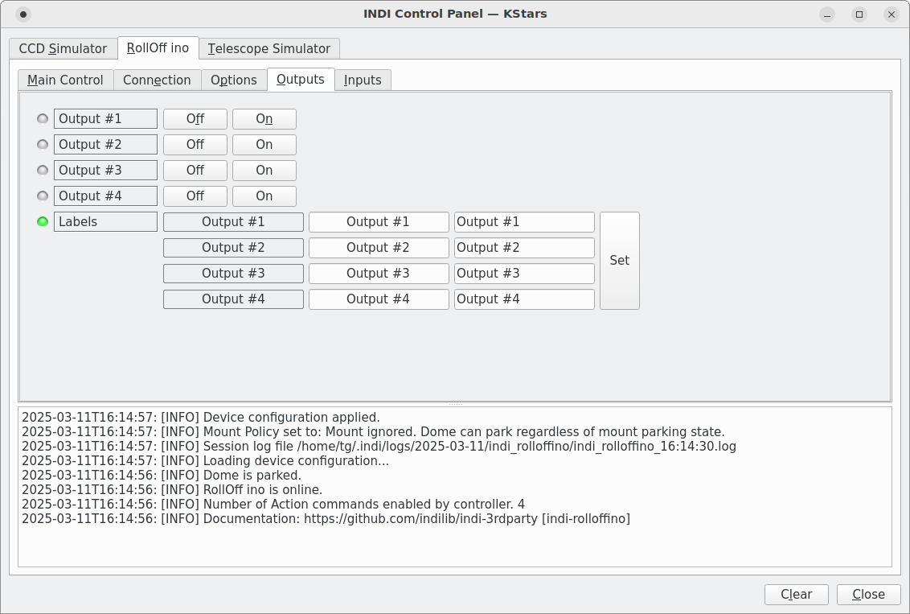
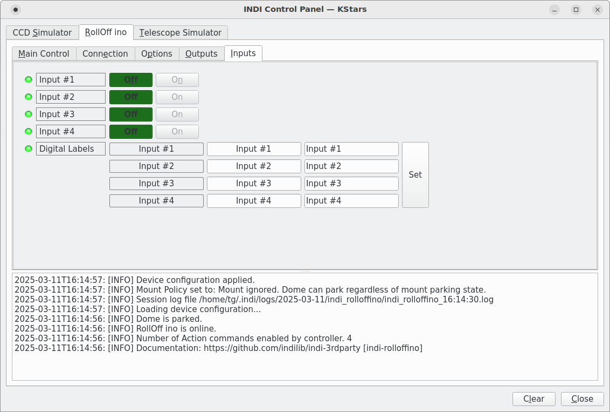

# An INDI Roll Off Roof Driver

RollOffino roof driver using an Arduino to open and close the roof.
The roof driver communicates with an Arduino that in turn interfaces with a roof motor or roof controller. The driver communicates with the Arduino using a basic set of commands. It is the Arduino working from this standard interface with the driver that requires adaptation to control the selected motor. The driver provides an interface sufficient to open, close and determine if the roof is fully opened or fully closed for a roll-off or similar roof.


The driver as with other INDI drivers can be on the same host as the Ekos client or remote on a different computer located in the observatory. The Arduino can be local to the roll-off roof driver using a USB connection. A suitably equired Arduino could be connected to the roll-off roof driver using a WiFi connection. The Arduino activates the circuits that control the roof motor. The motor control can be provided by a re-purposed commercial opener, or a controller suitably built or bought to match requirements for the selected motor.

# The driver

When installed, the RollOff ino driver will be available for selection under Domes in the Ekos profile definition editor.


USB is the normal connection method between the driver and the Arduino. It uses a default transmission rate of 38400 baud which can be changed in the Arduino code. The driver responds to Open and Close commands from the Ekos Observatory panel. These commands are sent to the Arduino in the form of open and close requests. The Arduino uses the requests to set relays to activate roof movement. The driver will generate requests to obtain the state of the fully open and fully closed switches to determine when the park or unpark request have been completed. There is also an Abort button which should stop any movement in progress. A lock status intended to indicate some form of external mechanical roof lock has been applied. If the lock switch is closed it will block the driver from issuing movement requests.

In the current version of the driver additional digital input and output interfaces are available. They can be used to set relays and receive the state of switches. Provided in the Universal Rolloff driver they operate here in a similar manner. They correspond to matching Actions in the Arduino. There is a need to maintain backward compatibility with previous versions of Arduino code. The Arduino will inform the driver how many if any digital input and outputs it expects. There is an Auxiliary function in the driver which could be replaced using the digital input output buttons. It is retained for backward compatibility with earlier Arduino versions.
.
## Observatory interface.
The observatory interface's open and close buttons can used to open and close the roof.


## INDI control panels.
The INDI Control panels provide the detail and setup interfaces.

### The Main Panel
The Main panel's periodic monitoring of the roof status as provided by the Arduino code is reflected in the status lights. The Open and Close buttons provide local roof controls.


### The Connection Panel
The Connection panel is where the USB connection baud rate can be set to match the Arduino code. It is where the USB used for the connection is established.


### The Options Panel
The Options panel is for the setting of the standard driver INDI options and for specifying roof's view of interactions with the telescope mount.


### The Output Panel
The Output panel is for sending digital on/off requests to the Arduino..



### The Input Panel
The Input panel is for receving digital on/off status from the Arduino..



## Weather protection.
The driver will interact with the Ekos weather monitoring applications or DIY local sensors and the watchdog timer along with the other dome related drivers.

# The Arduino
The Arduino code examples include the communication with the driver, the parsing and decoding of the commands and responses. There is communication error checking, any error messages will be sent back to the driver for logging. The mapping of commands to relay activation is provided. Also the mapping of status switch to command status response. The actual hardware pin to relay, and switch to pin assignments are to be specified. The Arduino's communication with the driver is passive, when there is no roof activity it waits for input. The set of built in commands and responses that the driver can handle along with the communication syntax is outlined below in the communication protocol summary.

It is the Arduino code along with hardware build that is responsible for controlling the safe operation of the roof. How that is done is unknown to the driver. The Arduino receives Open and Close commands from the INDI driver. The Arduino will acknowledge receiving the command. The driver will request the status of the fully open and fully closed switches to which the Arduino will respond. The roof must be brought to a stop when it reaches its limits. It must be able to handle obstructions safely. It should be able to respond to Abort requests from the user via the driver. Consideration should be given to what will happen if a switch fails to open or close and how to protect against over running the roof limits.

Using a commercial controller of some kind can simplify the design of the Arduino project. A controller can provide proper sizing of the motor for the size and weight of the roof. Provide obstruction protection, enforce range limits, variable force adjustments, slow start and slow stop to lessen the impact of sudden activation to get the roof moving. Some models will run off solar power and the choice of chain or track. With a controller that can be activated by a single or a pair of on/off button it is a simple job to wire a relay in parallel to emulate the pushing of a button. There is built in support in the example relay code to temporarily close a relay for a particular length of time. Such controllers have their own way of detecting the end of roof travel in order to stop movement. Additional switches are required to notify the Arduino when the roof is fully opened or fully closed. The Arduino can then relay that information to the driver when requested.

## Version Change
In the INDI 2.1.3 release Aditional digital input and outputs were added to the driver. The driver provides for up to eight od each. Arduino code written before the additions were added can not support the action requests and would report errors if they were communicated from the driver. Whether the additional input/outputs can be used will be determined when the Arduino first connects to the Rolloff Ino driver. If the Arduino code is older it will not indicate support for them when it responds to the driver's connection. Current examples provided with what the Arduino code refers to as Actions will inform the driver how many it can support. Only the number of actions that are supported in software and hardware should be requested. This will reduce chances for errors and limit the communication trafic.


## Arduino Examples

The following Arduino rolloff.ino examples have been removed: ar1450, linear_actuator, motor, and boutons.
The following examples have been renamed for interim use, standard and wifi to standard.prev and wifi.prev. Arduino code based on removed examples can continue to be used but will not provide the additional input and output switches.
The following rolloff.ino examples extended for the additional input/outputs have been updated. standard, relay, linear, syren. 

Example Arduino code is provided as a starting point. The Arduino code examples provide communication with the driver and template code for reading switches and setting relays. The selected starting code will need to be moved to a directory for development. The name of the directory and the name of the Arduino sketch should be the same. The code name must have a .ino extension. For example ~/Projects/arduino/roof/roof.ino Then you work in the Arduino IDE to edit and load the code onto your Arduino device. The IDE can be downloaded and installed from the arduino.cc web site. You use the IDE to select the type of Arduino board you are working with and define the USB port connecting it. The IDE can be used to edit the code, run builds and load the built sketch onto the Arduino board. https://www.arduino.cc/en/software. Use the most recent Arduino IDE 2 release.

### rolloff.ino.standard
General example as a starting point. If an external controller solution is to be used such as a sliding gate or garage opener controller that provides its own control for stopping the motor when it reaches limits. This is the Arduino code to use as a starting point. Its default pin assignments match the arduino.cc relay shield. Relay 1 to 4 being activated using pins 4, 7, 8, 12. If using a single button controller just relay 1 would need connection wiring. The default pins for the input switches is A0 through A3. The fully open switch connects to pin A0 and the fully closed switch is connected to pin A1. Another kind of controller might not provide the abiltiy to stop itself when end of travel is reached. In that case as well as sending the status back the driver would need to add activation of the stop. Includes potential support for Actions. No Actions are requested or implemented. An edit to the connection handshake will activate the requesting of Actions. 

### rolloff.ino.relay-action
Like the standard but does indicate Actions accepted during the handshake with the driver. Uses both a relay shield and a four channel relay module. Provides two example Actions associated with the four channel relay module. The first Action sets a momentary relay (push button) and provide status feedback. The second action sets and holds a relay until manually released no status response provided.

### rolloff.ino.relay-stop
This example uses two relays one to open and one to close the roof. It monitors the 
fully closed and fully open switches and when they do close it turns off the related 
relay to stop the motion. It is for low power use, interfacing with a control
switch or some other level of indirection protected from any solenoid surges. This sketch pin 
selections match the Arduino.cc relay shield. A relay bank could be used instead.

### rolloff.ino.linear
Use of a separate four channel relay module and no relay shield. Two Linear Actuators operating in unison activated by the roof open and close buttons. A LN298N motor controller is used to operate the linear actuators. The LN298N PWM option is used to compensate for differences in performance between the linear actuators. Uses one of the relays to apply power to the LN298N when movement activated. Shows example of Actions using the ones from rolloff.ino.relay.

### rolloff.ino.syren.
This example controls a 12 volt DC motor using a SyRen motor driver. This is an Arduino Mega example, no relays are used. Fully open and fully closed sensors are used to know when to stop the motor. Two extra sensors provide slow start and stop. The code uses a SyRen 50A motor driver to vary power to the motor and reverse polarity in order to change direction. It uses soft start and soft stop by ramping up and down the speed of the motor to open and close the roof. The SyRen powers the motor and can also supply 5 volts to power an Arduino. It includes code for using local buttons. Code is a subset from a working system with the extended Action edits made. It has not received testing in its presnt form. The SyRen documentation indicates that if using a power supply a 12V battery should also be used. The image shows a batery powered SyRen installation. The Arduino uses a separate power supply.

### rolloff.ino.standard.prev
Example code undisturbed by the addition of Actions. Used for testing old Arduino to newer driver. Retained for a while. 

### rolloff.ino.wifi.prev
This now dated test code for using WiFi to connect to the driver. It requires an Arduino model that supports the WIFININA library, the example was for the Uno WiFi Rev2. The code is the rolloff.ino.standard modified to use WiFi instead of USB. Might be useful if the observatory computer is located on or next to the telescope. As coded it works on WiFi networks using WPA2 for security. If using an open or WEP secured network changes as outlined in the Arduino WIFININA documentation will be needed. It uses a permanently defined internet address and port that matches the definition in the rolloffino driver. The changes are identified by the conditional #USE_WIFI. If it was wanted to use WiFi with one of the other examples similar edits could be made. It is example code without user feedback. 

### rolloff.ino.stub.
A sketch that could be used for initial testing of communication between the driver and an Arduino.
When loaded it operates without any switch or relay connections. It simply accepts initial connect, and open/close commands from the driver. After a delay it returns fully open or fully closed status to the driver. 

# Arduino Code Overview

Overview of the code used in the rolloffino.standard example. This is to assist those new to working with Arduino code and needing to customize. If using a controller that can be operated via relays and you use the default Arduino pins to connect the relay(s), there might not be any need for modifications.

## Definitions section
Modify to requirements

The terms HIGH, LOW, ON, OFF are defined by the Arduino environment and explained in the Arduino IDE documentation.

For the relays and switches in use define the pin numbers that match the wiring. The commands from the driver OPEN, CLOSE, ABORT, AUXSET are associated with a relay RELAY_1, RELAY_2, RELAY_3, RELAY_4. And those relay names are in turn defined to be a particular pin number on the Arduino. Define similar associations for the driver requests to read the fully open, fully closed and other switches.

Then you define for each of the relays if they are to be set and left in the requested state or if just a momentary set is to be used. If for the relay associated with the command the HOLD is set to 0, it will be closed and released. The timing of this is defined below by the DELAY settings. The idea is to emulate a push and release of a button. If for particular a relay HOLD is defined as 1, then the relay will be set and left closed or opened depending upon the request.

Following the definitions for the switches and relays are the internal buffer definitions and limits which should be left alone, they are matched in the driver.

Next any additional error messages can added for logging by the driver.

## Utility routines

### sendAck and sendNak
Used to respond to each driver input and used as is. Each input must receive a positive or negative response. A positive response will return the result. A negative response will be accompanied by an error message.

The next two routines might require modification depending upon how you connect your switches and relays.

### setRelay
Modify to requirements
Requires modification depending upon how you connect your relays. The comments in the routine header might relate if you use a module that provides a bank of relays and associated circuitry. It describes how to connect an Arduino and have it isolated and protected from back surges from the relay. There is help on this wiring available on-line. Use the comments in the body as a guide for when the relay should be opening or closing. Determine given your relay module and wiring how it should be controlled and if needed change around the use of HIGH and LOW in the routine.

### getSwitch
Modify to requirements
Requires modification depending upon how you connect your switches. Similar to the setRelay is the question of how the switches are setup and if they have pull-up or pull-down resistors. They must have one or the other. If unsure read about it in the Arduino IDE documentation. In summary if external pull down resistors are used an open switch will return LOW. If external or the Arduino's internal pull-up resistors are used an open switch will return HIGH. So whether open switch is HIGH or LOW match that to the OFF in the routine.

## Communication routines

### parseCommand
Used by the readUSB routines to break down the strings from the driver into their parts.
readUSB

### readUSB
Determines type of input. Resolves the named action or state into an associated relay or switch and its associated pin number. If it is an initial connection request it willl acknowledge that with the local code's version number. Returns a negative acknowledgement with message for any errors found. When valid command or request is decoded it calls commandReceived or requestReceived routines. These routines are meant to provide for additional action if something other or in addition to the default behavior is wanted. It also calls out to isAbortAllowed routine in case non default decision making is wanted. If using a commercial opener of some kind where needed action can be related to the use of a relay the default actions may well suffice. If you need to locally track the motor movement then these breakout points might be of interest.

## Intervention routines
These routines are when the final action for a command or request is about to take place. They would be extended or changed if the default use of a relay was not what was needed. The linear sketch demonstrates an example of extending the functionality . It defaults to the relay for some commands and uses additional routines for others such as open, close and stop. See use of the startCommand()

### isAbortAllowed
Change if default conditionals are not what you need.
The readUSB routine has received an Abort command. The default implementation is working with just the one button to control the roof. The decision whether or not to proceed is taken in this routine. Returning false will send negative acknowledgement to the driver. Returning true will result in the abort command being allowed through to the commandReceived routine which will activate the the associated relay.

### commandReceived
Change if default action of setting a relay is not what you need.

### requestReceived
Change if default action of reading the pin and sending result to the driver is not what you need.

## Standard routines
### setup
Modify to requirements
If using an AtMega variant Arduino model you can elect to use the built in pull-up resistors on the input pins. To do this use INPUT_PULLUP instead of INPUT definition for the input pins. For the setting of the relay pins use HIGH or LOW depending on which sets your relays to open.

### loop
This is the Arduino loop that waits for driver input.

# Communication Protocol
Outline of the communication between the roof driver and the Arduino
The communication uses a simple text protocol, lines of text are sent and received.
A Command is from the rolloffino driver to the Arduino sketch. A Response is from the Arduino sketch to the rolloffino driver. The driver will log these commands and responses to a file when debug logging is enabled.

```
Command Format:  (command:target|state:value)
Response Format: (response:target|state:value)

Command:   CON 	(CON:0:0)              Establish initial connection with Arduino
	   GET	(GET:state:value)      Get state of a switch
	   SET 	(SET:target:value)     Set relay closed or open

           state:   OPENED | CLOSED | LOCKED | AUXSTATE | ACTnSTATE
           target:  OPEN | CLOSE | ABORT | LOCK | AUXSET | ACTnSET
           value:   ON | OFF | 0 | text-message

Response:  ACK       Success returned from Arduino
	   NAK       Failure returned from Arduino

Examples:        From the Driver      Response From the Arduino
                 ----------------     --------------------------
Initial connect (CON:0:0)          >   	
                                   <  (ACK:0:version) | (ACK:0:version [actions]) | (NAK:ERROR:message)
Read a switch   (GET:OPENED:0)     >
                                   <  (ACK:OPENED:ON|OFF) | (NAK:ERROR:message)
Set a relay     (SET:CLOSE:ON|OFF) > 
                                   <  (ACK:CLOSE:ON|OFF) | (NAK:ERROR:message)
```

# A project build example.

An Arduino Uno with a matching relay shield can be a straight forward installation.


The Aleko controller board. The AC power supply comes in at the top. To the lower left is the red and black wires feeding back to the Arduino relay. An adjustable potentiometer is visible around the midlle to control how much power is applied to overcome resistance before a blockage is declared.


Just an image showing the Aleko positioning magnet that the controller detects when the roof has reached the fully opened or fully closed position. It shows the track used to drive the roof. The roof will roll a little past where the detector is placed.


Example of a fully closed detection switch feeding to an Arduino pin.


From rolloff.ino.syren, install, a 12V DC motor using a SyRen 50A controller. The fused battery power supplies 12V to the SyRen which in turn feeds 12V to the motor. The Arduino uses a single pin to direct the SyRen.


