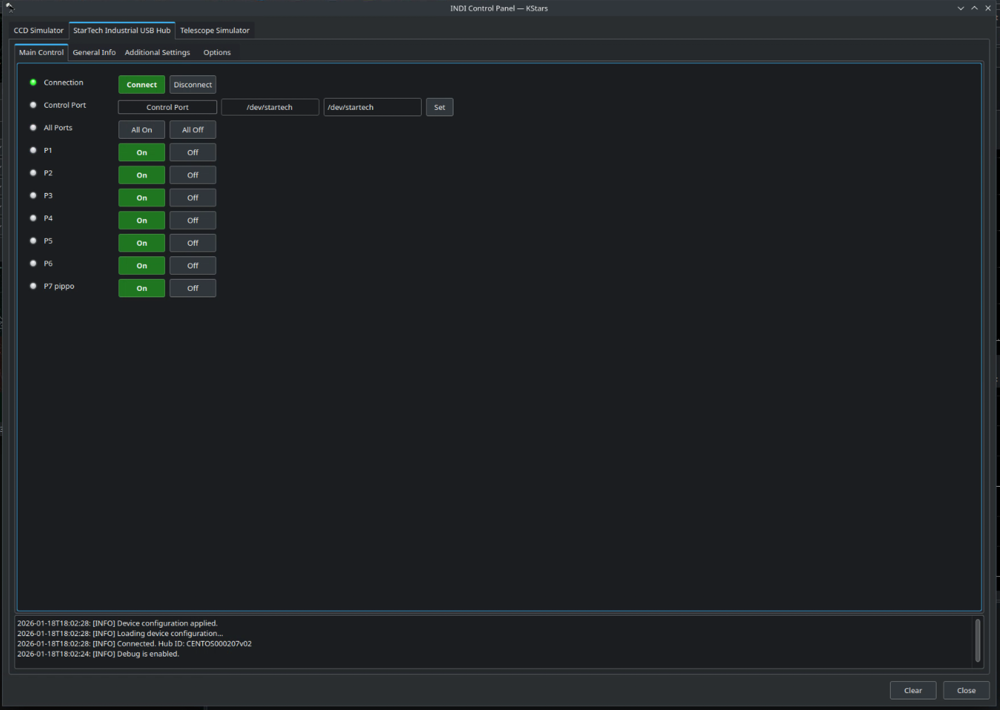
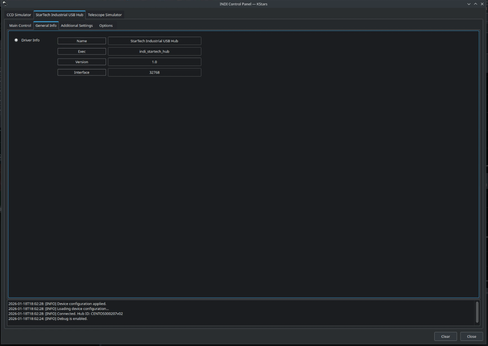
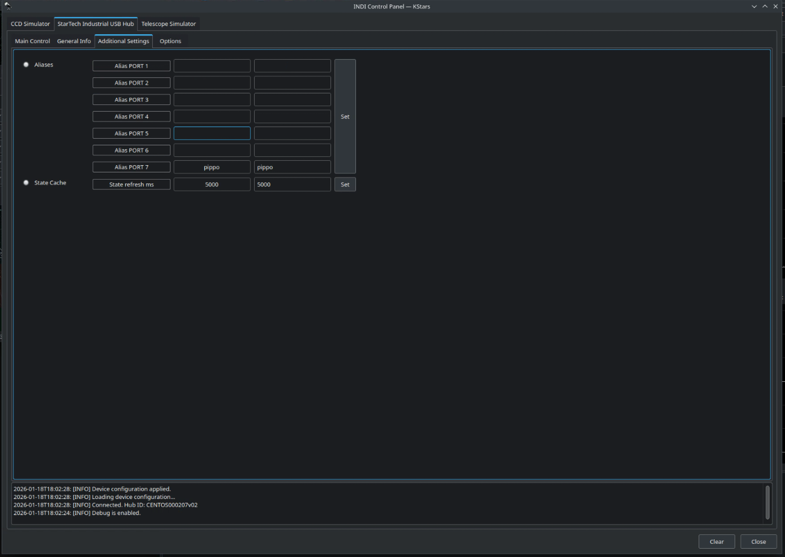
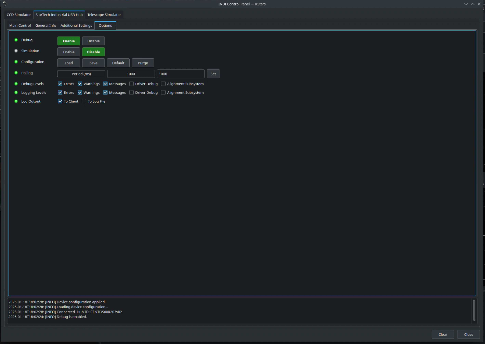

# StarTech Industrial USB Hub Driver (INDI)

## Overview

This INDI driver provides native support for the **StarTech 7-Port Managed Industrial USB 3.2 Gen 1 Hub**
(model **5G7AINDRM-USB-A-HUB**) https://www.startech.com/en-us/usb-hubs/5g7aindrm-usb-a-hub.

The driver allows to individually enable or disable USB ports on the hub, as well as to control all ports at once, directly from the INDI Control Panel.

---

## Supported Hardware

- **StarTech 5G7AINDRM-USB-A-HUB**
  - 7-port Managed Industrial USB 3.2 Gen 1 (5 Gbps)

---

## Features

The driver exposes the following functionality:

- Enable or disable **individual USB ports**.
- Enable or disable **all USB ports simultaneously**.
- Persist and restore port states via INDI configuration.
- User-defined **port aliases** for easier identification.

> ⚠️ Password handling and hub authentication rely on the device’s default protocol behavior.
> The driver does **not** modify or generate passwords.

---

## User Interface

### Main Control Tab

The **Main Control** tab follows standard INDI layout conventions and is intentionally minimal:

1. **Connection**
   - Standard INDI Connect / Disconnect buttons.

2. **Control Port**
   - Serial device path used to communicate with the hub  
     (for example: `/dev/startech`, `/dev/ttyUSB0`).
 
3. **All Ports**
   - `All On` / `All Off` buttons to control every port at once.

4. **Individual Ports**
   - Seven independent ON/OFF switches (`P1` … `P7`).
   - Optional aliases are shown directly in the port labels  



---

### General Info Tab

This tab is provided by the INDI framework and displays driver metadata:

- Driver name
- Executable name
- Version
- Interface flags



---

### Additional Settings Tab

The **Additional Settings** tab provides advanced configuration options:

#### Port Aliases

- Each USB port can be assigned a human-readable alias.
- Aliases are reflected directly in the **Main Control** tab.
- Useful for identifying connected devices (e.g. camera, focuser, mount).

#### State Cache

- Configurable refresh interval for port state polling.
- Reduces unnecessary serial traffic in stable configurations.



---

### Options Tab

Standard INDI options are available:

- Debug enable/disable
- Logging levels
- Configuration load/save/reset
- Polling period



---

## Technical Notes

- The driver communicates with the hub using its native serial management protocol.
- The serial connection is opened and closed per transaction, avoiding stale file descriptors.

---

## Building and Installation

This driver follows the standard **indi-3rdparty** build process.

Example:

```bash
mkdir -p build/indi-startech-hub
cd build/indi-startech-hub

cmake -DCMAKE_INSTALL_PREFIX=/usr -DCMAKE_BUILD_TYPE=Debug ~/Projects/indi-3rdparty/indi-startech-hub
make -j4
sudo make install


make
sudo make install
```
