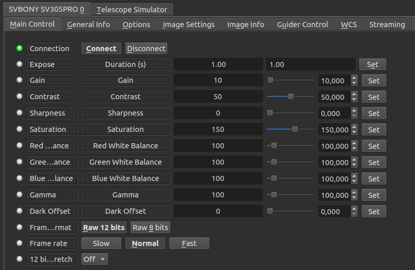
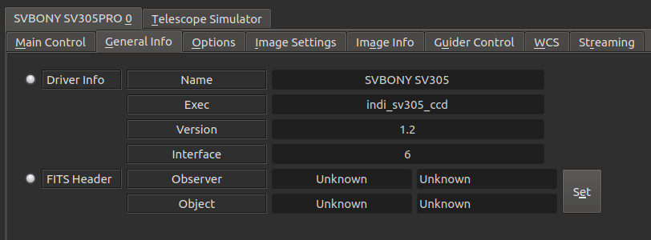
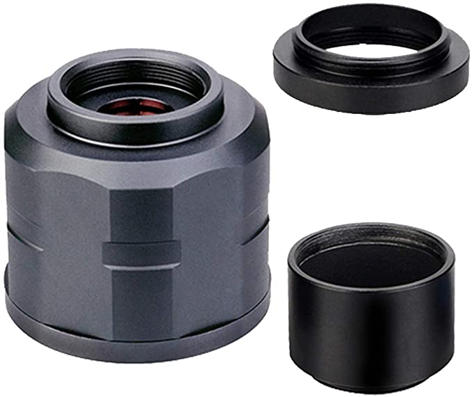
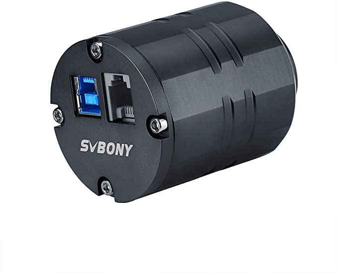
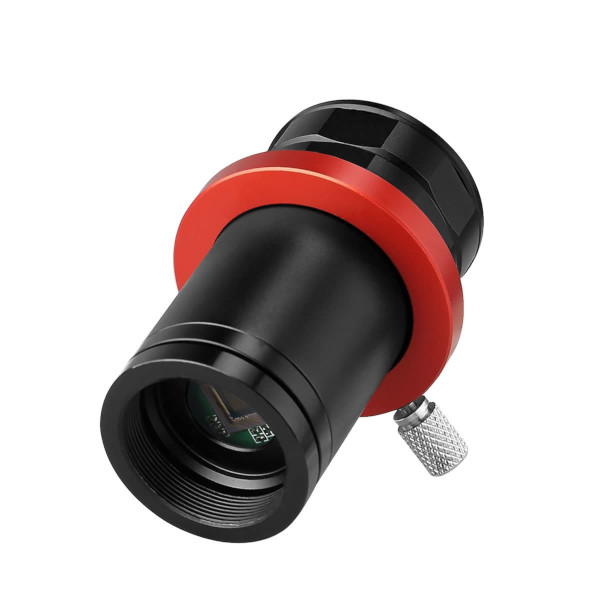

# SVBONY Astronomy cameras

## Installation

The INDI SV305 driver supports the SVBONY SV305, SV305 PRO, SV305M PRO and SV905C cameras on Intel (x86, amd64) and ARM (armv6, armv7 and armv8) Linux.
Mac OS X 64 bits is also supported.  
The SV105 and SV205 are UVC devices, please look at this page https://www.indilib.org/ccds/web-cameras.html  

In order to install the driver on Debian based distributions, use:  

> sudo add-apt-repository ppa:mutlaqja/ppa  
> sudo apt-get update  
> sudo apt-get install libsv305 indi-sv305  

## Features

The driver supports single framing and streaming.  

### Supported features:

- ST4 guiding on SV305 PRO
- ROI (snapshot and liveview)
- Binning (software, snapshot and liveview)
- Slow, medium and fast framing
- RAW8 and RAW12 frame format
- Dynamic stretching in RAW12 mode
- Color bayer pattern
- Cooler on SV405CC

### Known issues (mostly firmware related):

- Exposures can't be aborted
- Intensive configuration changes could lead to a crash
- Some shifts in frame order had been reported (frame N-1 uploaded instead of frame N)

## Operation

### Connecting to SV305 cameras

Simply connect the camera via USB to your PC or SBC (Single board computer).  
The camera can be connected to an external powered hub as well.  
You can connect multiple cameras.  

### Main Control

The controls tab provides settings to adjust common camera parameters such as gain, gamma, contrast..etc.  

You may choose between RAW 12 bits depth or RAW 8 bits depth frame format.  

For planetary imaging or fast streaming, use the ***Fast*** framerate. For long exposure, use ***Normal*** or ***Slow***.  

RAW 12 bits depth frames are stored as 16 bits FITS files.  
By default, the driver use the 12 least significant bits,  
resulting in very dark images. You can then choose a *stretch* factor.  

### General Info

This provides general information about the currently running driver and driver version.  
It also lets you set the Observer and Object Information for the FITS Header.  

### Miscellaneous

The other panels are common to all CCDs drivers.  

## Details

Website :		https://www.svbony.com/  
Tags :			CCD, camera, SVBONY  
Driver name :		SV305  
Driver executable :	indi_sv305_ccd  
Family :		CCDs  
Manufacturer :		SVBONY  
Platforms :		Linux (Intel, ARM),Mac OS X 64 bits  
Author :		Blaise-Florentin Collin  
Version :		1.3.0  

