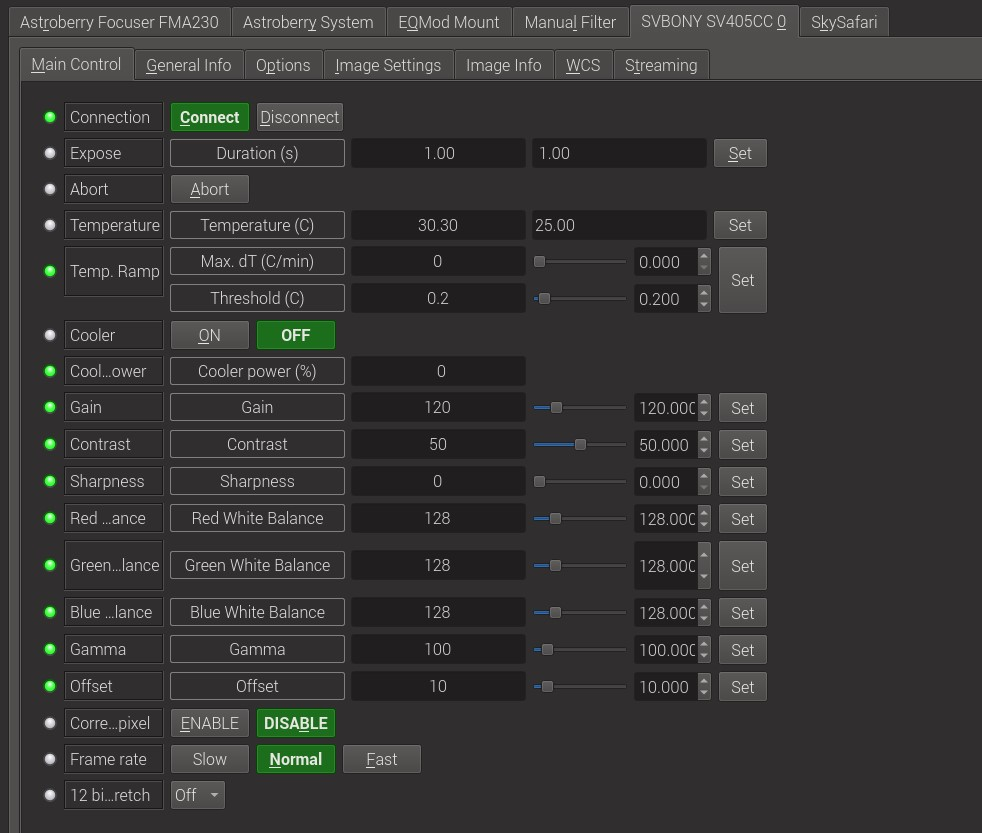

# SVBONY Astronomy cameras

## Installation

The INDI SVBONY driver supports cameras released after SVBONY SV305 on Intel (x86, amd64) and ARM (armv6, armv7 and armv8) Linux.  
Mac OS X 64 bits is also supported.  
The SV105 and SV205 are UVC devices, please look at this page https://www.indilib.org/ccds/web-cameras.html

In order to install the driver on Debian based distributions, use:  

> sudo add-apt-repository ppa:mutlaqja/ppa  
> sudo apt-get update  
> sudo apt-get install libsvbony indi-svbony  

## Features

The driver supports single framing and streaming.  

### Supported features:

- ST4 Guiding on camera models with guide port
- ROI (snapshot and liveview)
- Binning (software, snapshot and liveview)
- Slow, medium and fast framing
- RAW8, RAW16, YUV8 and YUV16 frame format
- Color bayer pattern
- Cooling Support with Cooling Camera

### Known issues (mostly firmware related):

- Intensive configuration changes could lead to a crash.
- The driver crashes when Native file format is selected and exposed.
- "Correct Dead Pixel" switch is alway turn off.
- "Banding noise" is likely to occur.

## Operation

### Connecting to SVBONY cameras

Simply connect the camera via USB to your PC or SBC (Single board computer).  
The camera can be connected to an external powered hub as well.  
You can connect multiple cameras.  

### Main Control

The controls tab provides settings to adjust common camera parameters such as gain, gamma, contrast..etc.  

For planetary imaging or fast streaming, use the ***Fast*** framerate. For long exposure, use ***Normal*** or ***Slow***.  

### General Info

This provides general information about the currently running driver and driver version.  
It also lets you set the Observer and Object Information for the FITS Header.  

### Miscellaneous

The other panels are common to all CCDs drivers.  

## Details

Website :		https://www.svbony.com/  
Tags :			CCD, camera, SVBONY  
Driver name :		SVBONY  
Driver executable :	indi_svbony_ccd  
Family :		CCDs  
Manufacturer :		SVBONY  
Platforms :		Linux (Intel, ARM),Mac OS X 64 bits  
Author :		Blaise-Florentin Collin & Tetsuya Kakura  
Version :		1.3.8  

